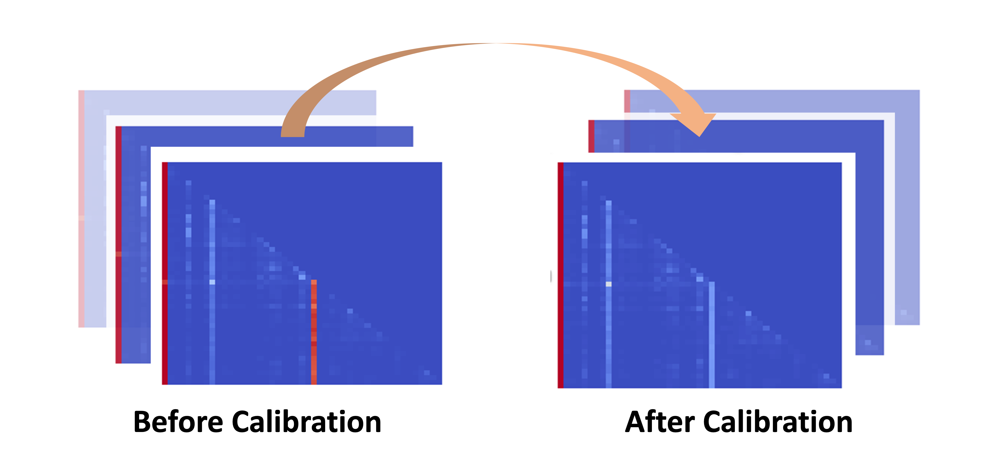

# Unveiling and Harnessing Hidden Attention Sinks: Enhancing Large Language Models without Training through Attention Calibration

[](https://opensource.org/licenses/Apache-2.0)

Zhongzhi Yu<sup>1,\*</sup>, Zheng Wang<sup>1,\*</sup>, Yonggan Fu<sup>1</sup>, Huihong Shi<sup>1</sup>, Khalid Shaikh<sup>1</sup>, Yingyan (Celine) Lin<sup>1</sup>

*<sup>1</sup> Georgia Institute of Technology*

Accepted by **[ICML 2024](https://icml.cc/Conferences/2024)**

More info: [[Paper](https://openreview.net/pdf?id=DLTjFFiuUJ)]

The official implementation of "Unveiling and Harnessing Hidden Attention Sinks: Enhancing Large Language Models without Training through Attention Calibration"

## Overview
Attention is crucial to the success of large language models (LLMs). However, the understanding of how attention distributions are formed is still limited. Recent studies highlight the presence of attention sinks, where the initial token gets large attention scores despite its low semantic value. This work explores this phenomenon further to understand attention sinks in LLMs and enhance their accuracy by optimizing attention distributions without weight fine-tuning.

We start with visualizations of attention distributions during inference across various inputs and tasks. Our findings reveal that (1) attention sinks occur not only at the start but also within later tokens, and (2) not all attention sinks positively impact LLM accuracy. Based on this, we propose a training-free Attention Calibration Technique (ACT) that optimizes attention distributions during inference in an input-adaptive manner. Extensive experiments show that ACT improves LLM accuracy by up to 7.30% across different datasets when applied to Llama-30B. Our code is available at this URL., ACT achieves an average improvement of up to $7.30%$ in accuracy across different datasets when applied to Llama-30B.
<p align="center">
</img>
</p>

## Installation
Install the dependencies using

``` bash
pip install -r requirements.txt 
```

## Run ACT
### Step 1. Search for Attention Heads That Needs to Be Calibrated
The first step of ACT is to identify a set of attention heads that need to be calibrated to enhance LLM's performance. 
Use the following command to perform this search process:
```
bash scripts/calibration.sh 
```
<p align="center">
</img>
</p>

### Step 2. Evaluation
#### 2.1 Classification Task
Use the following command to get the evaluation results of a certain classification dataset: 

```
bash scripts/evaluation.sh [ntrains] [augmentations] [dataset_names] [model_type] [model_path] "classification"
```

In the command above, set "augmentation" to 1 to activate ACT, "ntrains" refers to the number of samples in few-shot settings, which is defalt to 0.

#### 2.2 Multiple Choice Task
Similarly, use the following command to evaluation results of a certain multiple choice dataset: 

```
bash scripts/evaluation.sh [ntrains] [augmentations] [dataset_names] [model_type] [model_path] "multiple_choice"
```


#### 2.3 MT-Bench
We follow the official instructions from [MT-Bench](https://github.com/lm-sys/FastChat/tree/main/fastchat/llm_judge) to test ACT performance on chatting task. To reproduce the result, substitute mt-bench/gen_model_answer.py for [/FastChat/fastchat/llm_judge/gen_model_answer.py](https://github.com/lm-sys/FastChat/blob/main/fastchat/llm_judge/gen_model_answer.py), and add mt-bench/augment_index.py to the same directory.


## Citation
```bibtex
@article{yu2024unveiling,
  title={Unveiling and Harnessing Hidden Attention Sinks: Enhancing Large Language Models without Training through Attention Calibration},
  author={Yu, Zhongzhi and Wang, Zheng and Fu, Yonggan and Shi, Huihong and Shaikh, Khalid and Lin, Yingyan Celine},
  booktitle={International Conference on Machine Learning},
  year={2024}
}
```